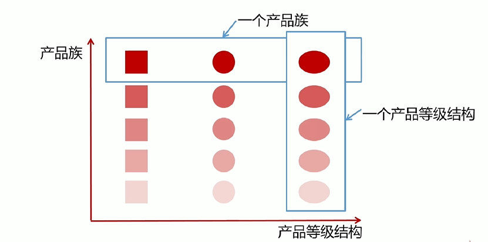
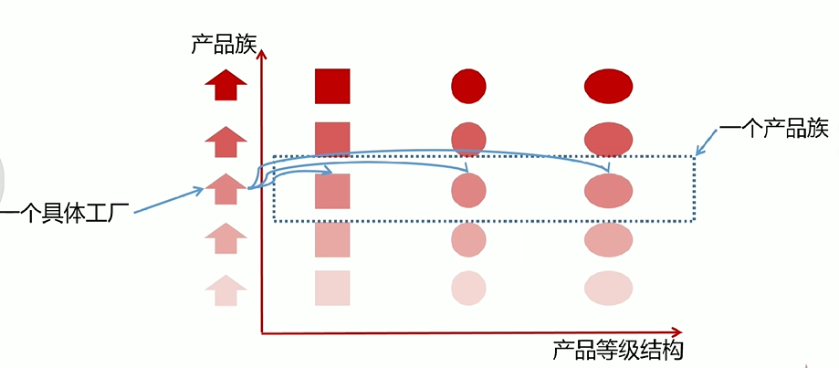
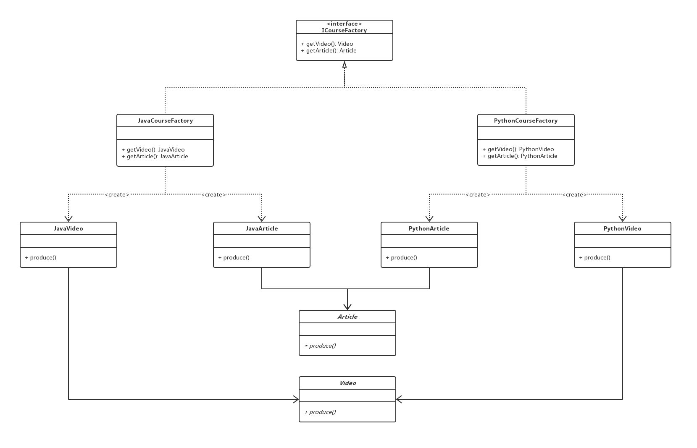

# 抽象工厂

## 0x01.定义与类型

- 定义：抽象工厂模式提供一个创建一系列相关或相互依赖对象的接口
- 无需指定它们具体的类
- 类型：创建型
- UML


- 基本java实现

```java
/**
 * 工厂接口
 */
public interface IFactory {
    AProduct1 createProduct1();
    AProduct2 createProduct2();
}

/**
 * 产品1
 */
public abstract class AProduct1 {
    public abstract void produce();
}

/**
 * 产品2
 */
public abstract class AProduct2 {
    public abstract void produce();
}

/**
 * 工厂实现
 */
public class FactoryImpl implements IFactory {
    @Override
    public ProductImpl1 createProduct1() {
        return new ProductImpl1();
    }
    @Override
    public ProductImpl2 createProduct2() {
        return new ProductImpl2();
    }
}

/**
 * 产品1实现
 */
public class ProductImpl1 extends AProduct1 {
    @Override
    public void produce() {
        System.out.println("产品1");
    }
}

/**
 * 产品2实现
 */
public class ProductImpl2 extends AProduct2 {
    @Override
    public void produce() {
        System.out.println("产品2");
    }
}

/**
 * 测试与应用
 */
public class Test {
    public static void main(String[] args) {
        FactoryImpl factory = new FactoryImpl();
        ProductImpl1 productImpl1 = factory.createProduct1();
        ProductImpl2 productImpl2 = factory.createProduct2();
        productImpl1.produce();
        productImpl2.produce();
    }
}

```

- 输出结果

```log
产品1
产品2
```

- 抽象工厂中的元素
  - 工厂接口：在抽象工厂模式中，工厂接口定义了同一类型的工厂可以生产多种不同的产品，定义了产品的种类。当工厂生成的种类发生变化时，要调整接口中的方法，这里违反了开闭原则，但是扩展不同类型的工厂，只需要实现接口就可以了。
  - 工厂实现类：定义了具体的工厂以及具体生成的类型，有多少中类型的工厂，就有多少个具体的实现类。
  - 具体产品的抽象类：一个工厂有可能生产出不同的产品，抽象类定义工厂生产产品的种类，抽象工厂接口中有多少个方法，就有多少个抽象类。
  - 具体产品的实现：最后得到的具体产品，决定了产品在客户端中的具体行为。

## 0x02.适用场景

- 客户端（应用层）不依赖于产品类实例如何被创建，实现等细节
- 强调一系列相关的产品对象（属于同一产品族）一起使用创建对象需要大量重复的代码
- 提供一个产品类的库，所有的产品以同样的接口出现，从而使客户端不依赖于具体实现

## 0x03.优点

- 具体产品在应用层代码隔离，无需关心创建细节
- 将一个系列的产品族统一到一起创建
- 在类的内部对产品族进行约束。所谓的产品族，一般或多或少的都存在一定的关联，抽象工厂模式就可以在类内部对产品族的关联关系进行定义和描述，而不必专门引入一个新的类来进行管理。

## 0x04.缺点

- 规定了所有可能被创建的产品集合，产品族中扩展新的产品困难，需要修改抽象工厂的接口
- 增加了系统的抽象性和理解难度

## 0x05.产品等级结构与产品族介绍





- 以家用电器为例：
  - 美的：空调，热水器，冰箱，洗衣机
  - 海尔：空调，热水器，冰箱，洗衣机
  - 美的的全部产品属于一个产品族
  - 美的的热水器和海尔的热水器属于一个产品等级
  - **美的**和**海尔**属于不同的工厂
  - **空调，热水器，冰箱，洗衣机**属于同一工厂生产的不同产品

## 0x06.样例实现

> 简介：慕课网的每一门课程都有手记和视频等，课程又分Java课程，Python课程

- 课程工厂类

```java
//课程工厂
public interface ICourseFactory {
    Video getVideo();
    Article getArticle();
}
```

- 文章/视频抽象类

```java
//文章抽象类
public abstract class Article {
    public abstract void produce();
}

//视频抽象类
public abstract class Video {
    public abstract void produce();
}
```

- Java课程的实现

```java
//Java课程工厂
public class JavaCourseFactory implements ICourseFactory {
    @Override
    public JavaVideo getVideo() {
        return new JavaVideo();
    }

    @Override
    public JavaArticle getArticle() {
        return new JavaArticle();
    }
}

//Java视频
public class JavaVideo extends Video {

    @Override
    public void produce() {
        System.out.println("录制JAVA课程视频");
    }
}

//Java文章
public class JavaArticle extends Article {
    @Override
    public void produce() {
        System.out.println("编写Java课程手记");
    }
}
```

- Python课程实现

```java
//Python课程工厂
public class PythonCourseFactory implements ICourseFactory {
    @Override
    public Video getVideo() {
        return new PythonVideo();
    }

    @Override
    public Article getArticle() {
        return new PythonArticle();
    }
}

//Python视频实现
public class PythonVideo extends Video {
    @Override
    public void produce() {
        System.out.println("录制Python视频");
    }
}

//Python文章
public class PythonArticle extends Article {
    @Override
    public void produce() {
        System.out.println("编写Python课程手记");
    }
}
```

- 测试与应用类

```java
public class Test {
    public static void main(String[] args) {
        //java 产品族
        ICourseFactory courseFactory = new JavaCourseFactory();
        Video video = courseFactory.getVideo();
        Article article = courseFactory.getArticle();
        video.produce();
        article.produce();
    }
}
```

- 输出结果

```log
录制JAVA课程视频
编写Java课程手记
```

- 样例UML类图



## 0x07.源码中的抽象工厂

- java.sql.Connection
  - Statement
  - PreparedStatement
- java.sql.Statement
  - executorSet
- MyBatis: SqlSessionFactory

## 0x08.源码地址

- `抽象工厂模式`: [https://github.com/sigmaol/design-pattern/tree/master/abstract-factory](https://github.com/sigmaol/design-pattern/tree/master/abstract-factory)

## 0x09.参考

- `慕课网设计模式精讲`: [https://coding.imooc.com/class/270.html](https://coding.imooc.com/class/270.html)
- `23种设计模式（3）：抽象工厂模式`: [https://blog.csdn.net/zhengzhb/article/details/7359385](https://blog.csdn.net/zhengzhb/article/details/7359385)
