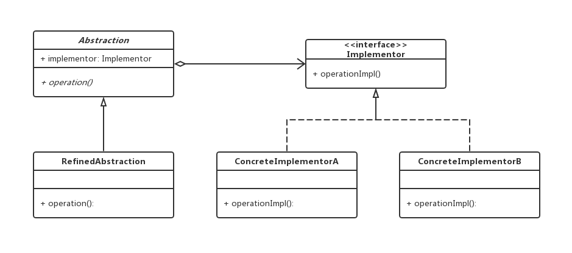
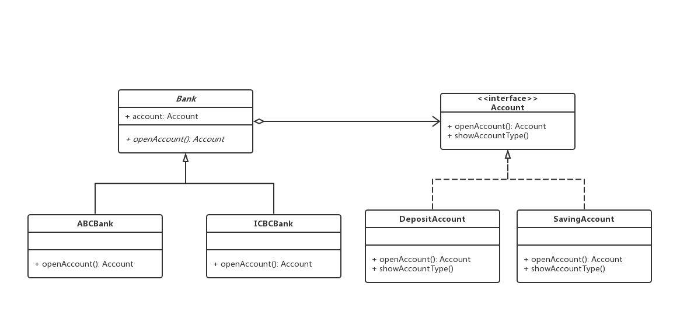

# 桥接模式

## 0x01.定义与类型

- 定义：将抽象部分与它的具体实现部分分离，使它们都可以独立地变化。
- 桥接模式将继承关系转化成关联关系，它降低了类与类之间的耦合度，减少了系统中类的数量，也减少了代码量。
- 桥接模式中的所谓脱耦，就是指在一个软件系统的抽象化和实现化之间使用关联关系（组合或者聚合关系）而不是继承关系，从而使两者可以相对独立地变化，这就是桥接模式的用意。
- 类型：结构型
- UML类图



- Java实现

```java
/**
 * 主类抽象类
 */
public abstract class Abstraction {
    /**
     * 桥接组合对象
     */
    protected Implementor implementor;

    public Abstraction(Implementor implementor) {
        this.implementor = implementor;
    }

    /**
     * 操作类
     */
    public abstract void operation();
}

/**
 * 抽象接口
 */
public interface Implementor {
    void operationImpl();
}

/**
 * 实现类
 */
public class RefinedAbstraction extends Abstraction {

    public RefinedAbstraction (Implementor implementor) {
        super(implementor);
    }

    @Override
    public void operation() {
        System.out.println("操作");
        implementor.operationImpl();
    }
}

/**
 * 接口抽象实现1
 */
public class ConcreteImplementorA implements Implementor {
    @Override
    public void operationImpl() {
        System.out.println("桥接A");
    }
}

/**
 * 接口抽象实现2
 */
public class ConcreteImplementorB implements Implementor {
    @Override
    public void operationImpl() {
        System.out.println("桥接B");
    }
}
```

- 测试与应用

```java
/**
 * 测试与应用
 */
public class Test {
    public static void main(String[] args) {

        Abstraction abstraction1 = new RefinedAbstraction(new ConcreteImplementorA());
        Abstraction abstraction2 = new RefinedAbstraction(new ConcreteImplementorB());

        abstraction1.operation();
        abstraction2.operation();
    }
}
```

- 输出结果

```log
操作
桥接A
操作
桥接B
```

- 角色介绍
  - Abstraction：抽象类，定义其中一个维度，会组合实现类接口。
  - RefinedAbstraction：扩充抽象类，抽象类的派生类，是一个维度的具体实现。
  - Implementor：实现类接口，另一个维度的接口。
  - ConcreteImplementor：具体实现类，另一个维度的具体实现类。

## 0x02.适用场景

- 如果一个系统需要在构件的抽象化角色和具体化角色之间增加更多的灵活性，避免在两个层次之间建立静态的继承联系，通过桥接模式可以使它们在抽象层建立一个关联关系。
- 一个类存在两个（或多个）独立变化的维度，且这两个（或多个）维度都需要独立进行扩展。
- 对于那些不希望使用继承或因为多层次继承导致系统类的个数急剧增加的系统，桥接模式尤为适用。

## 0x03.优点

- 分离抽象部分及其具体实现部分，提高了比继承更好的解决方案。
- 提高了系统的可扩展性，在两个变化维度中任意扩展一个维度，都不需要修改原有系统。
- 实现细节对客户透明，可以对用户隐藏实现细节。
- 符合开闭原则
- 符合合成复用原则

## 0x04.缺点

- 桥接模式的引入会增加系统的理解与设计难度，由于聚合关联关系建立在抽象层，要求开发者针对抽象进行设计与编程。
- 桥接模式要求正确识别出系统中两个独立变化的维度，因此其使用范围具有一定的局限性。

## 0x05.样例实现

> 银行有农业银行和工商银行等等，而账户有活期账户和死期账户，两个维度很适合使用桥接模式，下面为具体实现：

- Java实现

```java
/**
 * 银行抽象类
 */
public abstract class Bank {

    protected Account account;

    public Bank(Account account) {
        this.account = account;
    }

    /**
     * 不限制方法名，但因为委派所以起的一样
     * 不要自己都实现了，要尽量把行为委托给组合的类
     * @return
     */
    abstract Account openAccount();
}

/**
 * 农业银行实现类
 */
public class ABCBank extends Bank {

    public ABCBank (Account account) {
        super(account);
    }

    @Override
    Account openAccount() {
        System.out.println("打开中国农业银行账号");
        account.openAccount();
        return account;
    }
}

/**
 * 工商银行实现类
 */
public class ICBCBank extends Bank {

    public ICBCBank(Account account) {
        super(account);
    }

    @Override
    Account openAccount() {
        System.out.println("打开中国工商银行账号");
        account.openAccount();
        return account;
    }
}

/**
 * 银行账号， 桥的实现接口
 */
public interface Account {
    /**
     * 打开账号
     * @return
     */
    Account openAccount();

    /**
     * 查看账号类型
     */
    void showAccountType();
}

/**
 * 定期账户实现类
 */
public class DepositAccount implements Account {
    @Override
    public DepositAccount openAccount() {
        System.out.println("打开定期账号");
        return new DepositAccount();
    }

    @Override
    public void showAccountType() {
        System.out.println("这是定期账号");
    }
}

/**
 * 活期账户实现类
 */
public class SavingAccount implements Account {
    @Override
    public SavingAccount openAccount() {
        System.out.println("打开活期账号");
        return new SavingAccount();
    }

    @Override
    public void showAccountType() {
        System.out.println("这是活期账号");
    }
}
```

- 测试与应用类

```java
/**
 * 测试与应用
 */
public class Test {

    public static void main(String[] args) {
        Bank icbcBank = new ICBCBank(new DepositAccount());
        Account icbcAccount = icbcBank.openAccount();
        icbcAccount.showAccountType();

        Bank abcBank = new ABCBank(new SavingAccount());
        Account abcAccount = abcBank.openAccount();
        abcAccount.showAccountType();
    }
}
```

- 输出结果

```log
打开中国工商银行账号
打开定期账号
这是定期账号
打开中国农业银行账号
打开活期账号
这是活期账号
```

- UML类图



## 0x06.相关设计模式

- 桥接模式和组合模式
  - 组合模式强调的部分和整体的组合
  - 桥接模式是平行级别上类的组合
- 桥接模式和适配器模式
  - 都是为了让两个东西配合工作
  - 适配器模式是改变已有的接口让其配合工作，把目的相似，接口不同的类适配起来。
  - 桥接模式是分离抽象和具体实现，目的是分离，把类的抽象和具体实现分离开，在此基础上把接口结合起来

## 0x07.源码中的桥接模式

- jdbc: Driver

## 0x08.源码地址

- `设计模式之桥接模式`: [https://github.com/sigmaol/design-pattern/tree/master/bridge](https://github.com/sigmaol/design-pattern/tree/master/bridge)

## 0x09.推荐阅读与参考

- `慕课网设计模式精讲`: [https://coding.imooc.com/class/270.html](https://coding.imooc.com/class/270.html)
- `设计模式读书笔记-----桥接模式`: [https://www.cnblogs.com/chenssy/p/3317866.html](https://www.cnblogs.com/chenssy/p/3317866.html)
