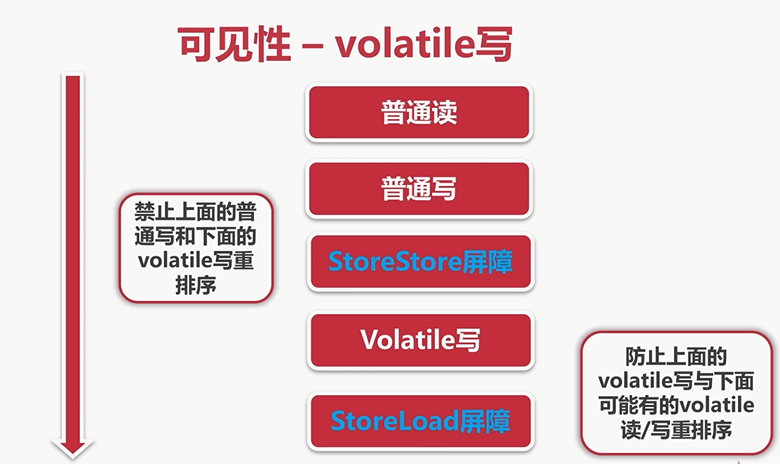
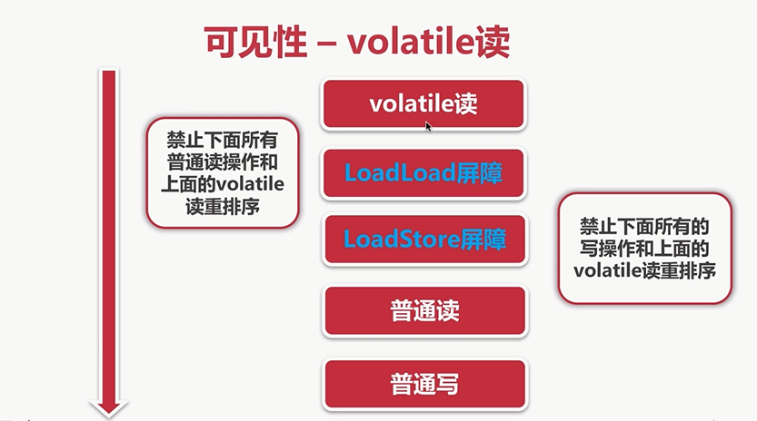
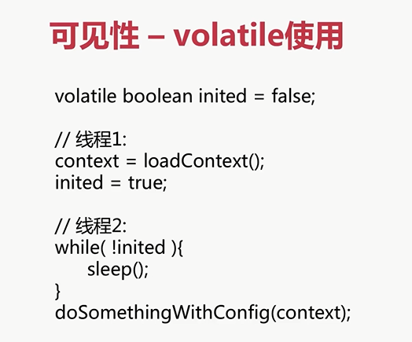

# 线程安全性

> 定义：当多个线程访问某个类时，不管运行时环境采用合众调度方式或者这些集成如何交替执行，并且在主调代码中不需要任何额外的同步或协同，这个类都能表现出正确的行为，那么就称这个类是线程安全的

## 线程安全性主要体现在三个方面

- 原子性：提供了互斥访问，同一时刻只能有一个线程来对它进行操作。
- 可见性：一个线程对主内存的修改可以及时的被其他线程观察到
- 有序性：一个线程观察其他线程中的指令执行顺序，由于指令重排序的存在，该观察结果一般杂乱无序

## 原子性 - Atomic包

- AtomicXXX: CAS, Unsafe.compareAndSwapInt
- AtomicLong, LongAdder
- LongAdder：将热点数据分离，按cell分离，将高并发数据分离提高性能；统计并发更新，可能有误差。高并发情况推荐LongAddr。
- 全局唯一的流水号就不适合LongAddr了。
- compareAndSet
- AtomicReference, AtomicReferenceFieldUpdater
- AtomicStampReference: CAS的 ABA 问题

### 原子性 - 锁

- synchronized: 依赖JVM
- Lock: 依赖特殊的CPU指令，代码实现，ReentrantLock

### 原子性 - synchronized

- 修饰代码块：大括号括起来的代码，作用于调用的对象
- 修饰方法：整个方法，作用于调用的对象
- 修饰静态方法：整个静态方法，作用于所有对象
- 修饰类：括号括起来的部分，作用于所有对象

### 原子性 - 对比

- synchronized: 不可中断锁，适合竞争不激烈，可读性好。
- Lock: 可中断锁，多样化同步，竞争激烈时能维持常态。
- Atomic: 竞争激烈时能维持常态，比Lock性能好；只能同步一个值。每次只能同步一个值。

## 可见性

### 导致共享变量在线程间不可见的原因

- 线程交叉执行
- 重排序结合线程交叉执行
- 共享变量更新后的值没有在工作内存与主存件及时更新

### 可见性 - synchronized

- JMM关于synchronized的两条规定：
  - 线程解锁前，必须把共享变量的最新值刷新到主内存
  - 线程加锁时，将清空工作内存中共享变量的值，从而使用共享变量时需要从主内存中重新读取最新的值（注意，加锁与解锁是同一把锁）

### 可见性 - volatile

- 通过加入**内存屏障**和**禁止重排序**优化来实现
  - 对volatile变量写操作时，会在写操作后加入一条store屏障指令，将本地内存中的共享变量值刷新到主内存
  - 对volatile变量读操作时，会在读操作前加入一条load屏障指令，从主内存中读取共享变量

## 有序性

- Java内存模型中，允许编译器和处理器对指令进行重排序，但是重排序过程不会影响到单线程程序的执行，却会影响到多线程并发执行的正确性
- volatile, synchronized, Lock

### 有序性 - happens-before原则

- 程序次序规则：一个线程内，按照代码顺序，书写在前面的操作先行发生于书写在后面的操作
- 锁定规则：一个unLock操作先行发生于后面对同一个锁的lock操作
- volatile变量规则：对一个变量的写操作先行发生于后面对这个变量的读操作
- 传递规则：如果操作A先行发生于操作B，而操作B又先行发生于操作C，则得出操作A先行于操作C
- 线程启动规则：Thread对象的start()方法先行发生于此线程的每一个动作
- 线程中断规则：对线程interrupt()方法的调用先行发生于被中断线程的代码检测到中断事情的发生
- 线程终结规则：线程中所有的操作都先行发生于线程的终止检测，我们可以通过Thread.join()方法结束，Thread.isAlive()的返回值手段检测到线程已经终止执行
- 对象终结规则：一个对象的初始化完成先行发生于它的finalize()方法的开始

## 线程安全性 - 总结

- 原子性：Atomic包，CAS算法，synchronized，Lock
- 可见性：synchronized, volatile
- 有序性：happens-before