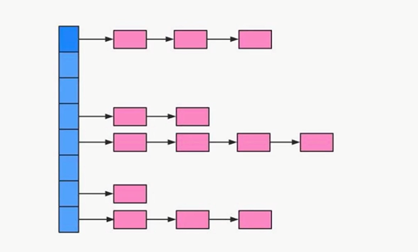
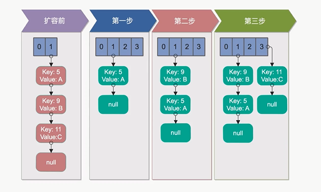
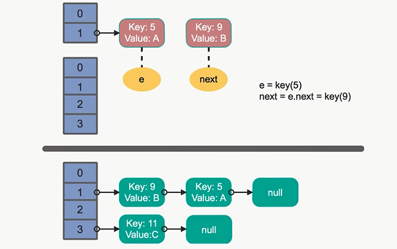
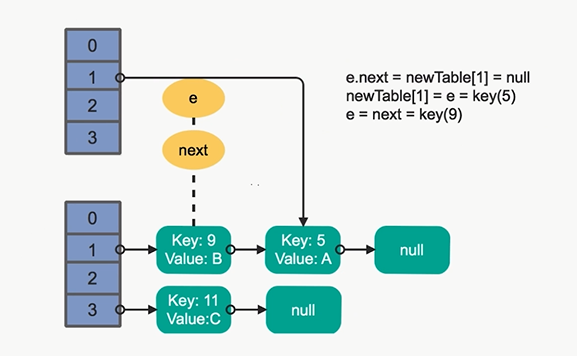
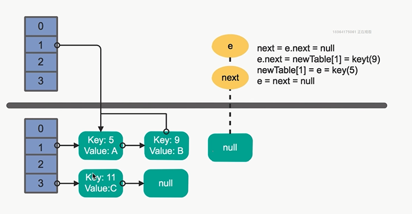
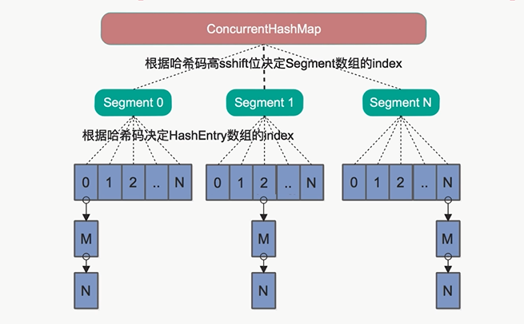
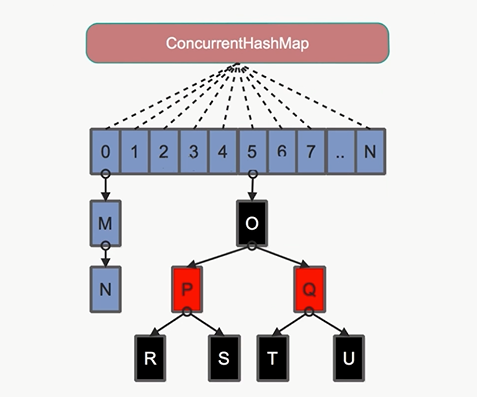
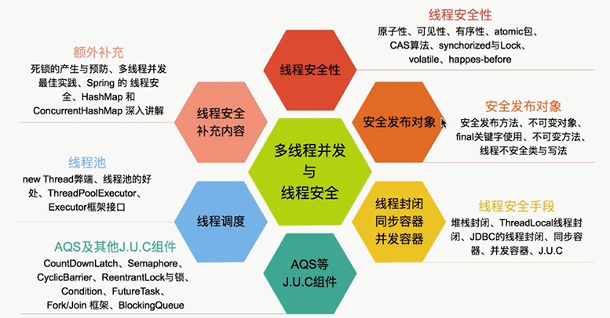

# 多线程并发拓展

## 死锁

> 两个或两个以上的线程因为争夺资源而造成的互相等待的情况。

### 死锁 - 必要条件

- 互斥条件
- 请求和保持条件
- 不剥夺条件
- 环路等待条件

## 多线程并发最佳实践

- 使用本地变量
- 使用不可变类
- 最小化锁的作用域范围：S=1/(1-a+a/n) 阿姆达尔定理
  - a: 并行计算步骤所占的比例
  - n: 并行处理的节点个数
  - S: 加速比
- 使用线程池的Executor，而不是new Thread
- 宁可使用同步也不要使用线程的wait和notify
- 使用BlockingQueue实现生产-消费模式
- 使用并发集合而不是加了锁的同步集合
- 使用Semaphore创建有界的访问
- 宁可使用同步代码块，也不使用同步的方法
- 避免使用静态变量

## Spring与线程安全

- Spring bean: singleton, prototype
- 无状态对象（不管单例还是多例都是线程安全的，例如DTO, VO）

## HashMap与ConcurrentHashMap

## 多线程并发与线程安全总结

