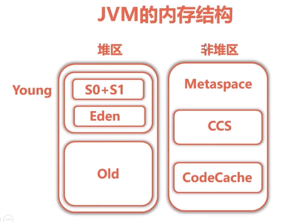

# 基于JDK命令行工具的监控

## JVM的参数类型

### 标准参数

- -help
- -server -client
- -version -showversion
- -cp -classpath

### X参数

- 非标准化参数
- -Xint: 解释执行
- -Xcomp: 第一次使用就编译成本地代码
- -Xmixed: 混合模式，JVM自己来决定是否编译成本地代码

### XX参数

- 非标准化参数
- 相对不稳定
- 主要用于JVM调优和Debug

#### XX参数的分类

- Boolean类型

```node
格式: -XX:[+-]<name>表示启动或者禁用name属性

比如:
    -XX:+UseConcMarkSweepGC #使用CMS收集器
    -XX:+UseG1GC #使用G1收集器
```

- 非Boolean类型

```node
格式: -XX:<name>=<value>表示name属性的值是value

比如:
    -XX:MaxGCPauseMillis=500 #GC最大停顿时间是500毫秒
    -XX:GCTimeRatio=19 #GCTimeRatio是19
```

#### -Xmx -Xms

- 不是X参数，而是XX参数
  - -Xms等价于-XX:InitialHeapSize
  - -Xmx等价于-XX:MaxHeapSize

## 运行时JVM参数查看

### 直接在java -XX:+PrinfFlagsInitial 查看

- -XX:+PrinfFlagsInitial 查看初始值
  - = 表示默认值
  - := 被用户或者JVM修改后的值
- -XX:+PrintFlagsFinal 查看最终值
- -XX:+UnlockExperimentalVMOptions解锁实验参数
- -XX:+UnlockDiagnosticVMOptions解锁实验参数
- -XX:+PrintCommandLineFlags打印命令行参数

### jps 查看进程

### jinfo

```shell
jinfo -flag [JVM参数] [进程号]
jinfo -flags [进程号]
```

## jstat查看虚拟机统计信息

- 类加载
- 垃圾收集
- JIT编译

### 命令格式

```shell
jstat -help|-options
jstat -<option> [-t] [-h<lines>] <vmid> [<interval> [<count>]]
# options: -class, -compiler, -gc, -printcompilation
```

#### 类加载

- jstat -class pid 1000 10
- jstat -class 1378

```log
Loaded  Bytes     Unloaded  Bytes     Time
  2692  5338.1        0     0.0       1.76
```

#### 垃圾回收

- jstat -gc pid 1000 10
- jstat -gc 1378

```log
 S0C     S1C    S0U    S1U      EC       EU        OC         OU       MC       MU        CCSC     CCSU     YGC    YGCT    FGC     FGCT     GCT
1024.0  1024.0  0.0    1.9    8192.0   6021.4   20480.0    14490.3   16640.0   16153.7   2048.0   1819.8     41    0.138    0      0.000    0.138
```

- S0C, S1C, S0U, S1U: S0和S1的总量与使用量
- EC, EU: Eden区总量与使用量
- OC, OU: Old区总量与使用量
- MC, MU: Metaspace区总量与使用量
- CCSC, CCSU: 压缩类空间总量与使用量
- YGC, YGCT: YoungGC的次数与时间
- FGC, FGCT: FullGC的次数与时间
- GCT: 总的GC时间

#### JVM内存结构



#### 查看JIT编译信息

- -compiler, -printcompilation

## jmap + MAT实战内存溢出

### 实现两种内存溢出（heap/Metaspace）

```java
package org.ko.web.chapter2;

import org.ko.web.chapter2.asm.Metaspace;
import org.ko.web.chapter2.bean.User;
import org.springframework.web.bind.annotation.GetMapping;
import org.springframework.web.bind.annotation.RestController;

import java.util.ArrayList;
import java.util.List;
import java.util.UUID;

/**
 * 内存溢出
 */
@RestController
public class MemoryController {

    private List<User> users = new ArrayList<>();
    private List<Class<?>> classes = new ArrayList<>();

    /**
     * -Xmx32M  -Xms32M
     * @return
     */
    @GetMapping("heap")
    public String heap() {
        int i = 0;
        for (;;) {
            users.add(new User(i++, UUID.randomUUID().toString()));
        }
    }

    /**
     * -XX:MetaspaceSize=32M -XX:MaxMetaspaceSize=32M
     * @return
     */
    @GetMapping("nonheap")
    public String nonheap() {
        for (;;) {
            classes.addAll(Metaspace.createClasses());
        }
    }

}

```

```java
package org.ko.web.chapter2.asm;

import org.objectweb.asm.ClassWriter;
import org.objectweb.asm.MethodVisitor;
import org.objectweb.asm.Opcodes;

import java.util.ArrayList;
import java.util.List;

public class Metaspace extends ClassLoader{

    public static List<Class<?>> createClasses () {
        //类持有
        List<Class<?>> classes = new ArrayList<>();
        //循环1000w次生产1000w个不同的类
        for (int i = 0; i < 10000000; ++i) {
            ClassWriter cw = new ClassWriter(0);
            //定义一个类名称为Class[i], 他的访问域为public, 父类为java.lang.Object，不实现任何接口
            cw.visit(Opcodes.V1_1, Opcodes.ACC_PUBLIC, "Class" + i, null,
                    "java/lang/Object", null);
            //定义构造函数<init>方法
            MethodVisitor mw = cw.visitMethod(Opcodes.ACC_PUBLIC, "<init>", "()V",
                    null, null);
            //第一个指定为加载this
            mw.visitVarInsn(Opcodes.ALOAD, 0);
            //第二个指令为调用父类Object的构造函数
            mw.visitMethodInsn(Opcodes.INVOKESPECIAL, "java/lang/Object",
                    "<init>", "()V");
            //第三条指令为return
            mw.visitInsn(Opcodes.RETURN);
            mw.visitMaxs(1, 1);
            mw.visitEnd();
            Metaspace metaspace = new Metaspace();
            byte[] code = cw.toByteArray();
            //定义类
            Class<?> exampleClass = metaspace.defineClass("Class" + i, code, 0, code.length);
            classes.add(exampleClass);
        }
        return classes;
    }
}

```

### 如何导出内存映像文件

- 内存溢出自动导出
  - -XX:+HeapDumpOnOutOfMemoryError
  - -XX:HeapDumpPath=./
- 使用jmap命令手动导出
  - jmap -dump:format=b,file=heap.hprof 8368

### MIT

- 下载：[https://www.eclipse.org/mat/downloads.php](https://www.eclipse.org/mat/downloads.php)

## jstack实战死循环与死锁

jstack pid > pid.txt

top -p pid -H 打印所有线程，查看cup占用率
printf "%x" pid 转换成16进制

jstack pid > pid.txt 可以直接输出死锁信息