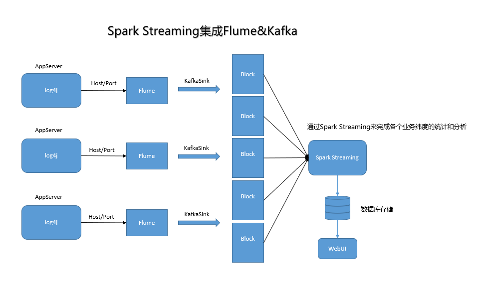

# Spark Streaming集成Flume&Kafka打造通用流处理平台



## 整合日志输出到Flume

- streaming.conf

```properties
streamingAgent.sources = avro-source
streamingAgent.channels = logger-channel
streamingAgent.sinks = log-sink

# define source
streamingAgent.sources.avro-source.type = avro
streamingAgent.sources.avro-source.bind = 0.0.0.0
streamingAgent.sources.avro-source.port = 41414

# define channel
streamingAgent.channels.logger-channel.type = memory

# define sink
streamingAgent.sinks.log-sink.type = logger

streamingAgent.sources.avro-source.channels = logger-channel
streamingAgent.sinks.log-sink.channel = logger-channel

```

```shell
flume-ng agent \
--conf $FLUME_HOME/conf \
--conf-file $FLUME_HOME/conf/streaming.conf \
--name streamingAgent \
-Dflume.root.logger=INFO,console
```

- Exception

```log
java.lang.ClassNotFoundException: org.apache.flume.clients.log4jappender.Log4jAppender
  at java.net.URLClassLoader.findClass(URLClassLoader.java:381)
  at java.lang.ClassLoader.loadClass(ClassLoader.java:424)
  at sun.misc.Launcher$AppClassLoader.loadClass(Launcher.java:335)
  at java.lang.ClassLoader.loadClass(ClassLoader.java:357)
  at java.lang.Class.forName0(Native Method)
  at java.lang.Class.forName(Class.java:264)
  at org.apache.log4j.helpers.Loader.loadClass(Loader.java:198)
  at org.apache.log4j.helpers.OptionConverter.instantiateByClassName(OptionConverter.java:327)
  at org.apache.log4j.helpers.OptionConverter.instantiateByKey(OptionConverter.java:124)
  at org.apache.log4j.PropertyConfigurator.parseAppender(PropertyConfigurator.java:785)
  at org.apache.log4j.PropertyConfigurator.parseCategory(PropertyConfigurator.java:768)
  at org.apache.log4j.PropertyConfigurator.configureRootCategory(PropertyConfigurator.java:648)
  at org.apache.log4j.PropertyConfigurator.doConfigure(PropertyConfigurator.java:514)
  at org.apache.log4j.PropertyConfigurator.doConfigure(PropertyConfigurator.java:580)
  at org.apache.log4j.helpers.OptionConverter.selectAndConfigure(OptionConverter.java:526)
  at org.apache.log4j.LogManager.<clinit>(LogManager.java:127)
  at org.apache.log4j.Logger.getLogger(Logger.java:117)
  at org.ko.log.LoggerGenerator.<clinit>(LoggerGenerator.java:12)
log4j:ERROR Could not instantiate appender named "flume".
```

  1. 添加flume-ng-log4jappender依赖后解决

  ```xml
  <dependency>
        <groupId>org.apache.flume.flume-ng-clients</groupId>
        <artifactId>flume-ng-log4jappender</artifactId>
        <version>1.8.0</version>
  </dependency>
  ```

## 整合Flume到Kafka

- flume-kafka.conf

```properties
kafkaAgent.sources = avro-source
kafkaAgent.channels = logger-channel
kafkaAgent.sinks = kafka-sink

# define source
kafkaAgent.sources.avro-source.type = avro
kafkaAgent.sources.avro-source.bind = 0.0.0.0
kafkaAgent.sources.avro-source.port = 41414

# define channel
kafkaAgent.channels.logger-channel.type = memory

# define sink
kafkaAgent.sinks.kafka-sink.type = org.apache.flume.sink.kafka.KafkaSink
kafkaAgent.sinks.kafka-sink.kafka.topic = kafka-streaming-topic
kafkaAgent.sinks.kafka-sink.kafka.bootstrap.servers = 192.168.37.131:9092
kafkaAgent.sinks.kafka-sink.kafka.kafka.flumeBatchSize = 20
kafkaAgent.sinks.kafka-sink.kafka.requiredAcks = 1

kafkaAgent.sources.avro-source.channels = logger-channel
kafkaAgent.sinks.kafka-sink.channel = logger-channel

```

```shell
flume-ng agent \
--conf $FLUME_HOME/conf \
--conf-file $FLUME_HOME/conf/flume-kafka.conf \
--name kafkaAgent \
-Dflume.root.logger=INFO,console
```

## 整合Kafka到Spark Streaming

```scala
package org.ko.spark.streaming.kafka

import kafka.serializer.StringDecoder
import org.apache.spark.SparkConf
import org.apache.spark.streaming.kafka.KafkaUtils
import org.apache.spark.streaming.{Seconds, StreamingContext}

/**
  * Spark Streaming对接Kafka的方式一
  * 192.168.37.131:9092 kafka-streaming-topic
  * 要求运行时kafka版本为0.8Q
  */
object KafkaStreamingApp {

  def main(args: Array[String]): Unit = {

    if (args.length != 2) {
      System.err.println("Usage: KafkaDirectWordCount <brokers> <topics>")
      System.exit(1)
    }

    val sparkConf = new SparkConf()
      .setAppName("KafkaStreamingApp")
      .setMaster("local[2]")

    val Array(brokers, topics) = args

    val ssc = new StreamingContext(sparkConf, Seconds(5))

    val kafkaParams = Map[String, String](
      "metadata.broker.list" -> brokers
    )

    val topicSet = topics.split(",").toSet

    //TODO... Spark Streaming 如何对接Kafka
    val messages = KafkaUtils
      .createDirectStream[String, String, StringDecoder, StringDecoder](ssc, kafkaParams, topicSet)

    messages.map(_._2).count().print()


    ssc.start()
    ssc.awaitTermination()


  }

}

```

## Spark Streaming对接收到的数据进行处理

- 业务逻辑编写

## 注意

我们现在是在本地进行测试的，在IDEA中运行LoggerGenerator，然后使用Flume，Kafka以及Spark Streaming进行处理操作。

这只是测试环境，如果是生产需要？

1. 打包JAR，执行LoggerGenerator类
2. Flume，Kafka生产测试环境是一样的
3. Spark Streaming的代码也要打包成JAR，然后使用spark-submit的方式提交到生产环境上进行，可以根据实际情况选择运行模式：local/yarn/standalone/mesos
4. 在生产上，整个流处理的流程都一样的，区别在于业务逻辑的复杂性。