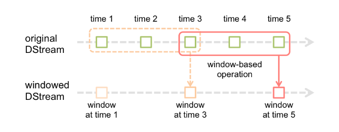

# Spark Streaming 进阶与案例实战

## 1.带状态的算子: UpdateStateByKey

## 2.实战：计算到目前位置累积出现的单词个数写入到MySql中

- 1.create table

```sql
CREATE TABLE `wordcount` (
    `word` VARCHAR(50) NOT NULL,
    `count` INT(11) NOT NULL,
    PRIMARY KEY (`word`)
)
COMMENT='单词统计表'
COLLATE='utf8mb4_german2_ci'
ENGINE=InnoDB  ;
```

- 2.代码实现

```scala
/**
  * <p>
  *  使用Spark Streaming完成有状态统计，并存到mysql中
  * </p>
  */
object ForeachRDDApp {

  def main(args: Array[String]): Unit = {
    val sparkConf = new SparkConf().setMaster("local[2]").setAppName("StatefulWordCount")
    val ssc = new StreamingContext(sparkConf, Seconds(5))


    val lines = ssc.socketTextStream("192.168.37.128", 6789)

    val result = lines.flatMap(_.split(" ")).map((_, 1)).reduceByKey(_ + _)

//    -----error------Task not serializable
//    result.foreachRDD(rdd => {
//      val conn = createConnection()
//      rdd.foreach { record =>
//        val sql = "INSERT INTO wordcount(word, count) " +
//          "VALUES('" + record._1 + "', '" + record._2 + "')"
//        conn.createStatement().execute(sql)
//      }
//    })

    result.print()

    result.foreachRDD {rdd =>
      rdd.foreachPartition {partitionOfRecords =>
        if (partitionOfRecords.nonEmpty) {
          val conn = createConnection()
          partitionOfRecords.foreach {pair =>
            val sql = "INSERT INTO wordcount(word, count) " +
              "VALUES('" + pair._1 + "', '" + pair._2 + "')"
            conn.createStatement().execute(sql)
          }
          conn.close()
        }

      }
    }
    ssc.start()
    ssc.awaitTermination()
  }

  def createConnection (): Connection = {
    Class.forName("com.mysql.jdbc.Driver")
    DriverManager.getConnection("jdbc:mysql:///spark_stream", "root", "tiger")
  }

}
```

- 3.存在的问题
  - 1.对于已有的数据做更新，而是所有的数据均为insert
    - 改进思路
      - 1.在插入数据前先判断单词是否存在，如果存在就update，不存在则insert.
      - 2.工作中：HBase/Redis
  - 2.每个RDD的partition创建connection，建议改成连接池

## 3.基于window的统计

- window: 定时的进行一个时间段内的数据处理



- window length: The duration of the window (3 in the figure). 窗口的长度，窗口长度是3。
- sliding interval: The interval at which the window operation s performed (2 in the figure). 窗口操作经过多久执行一次。
- 这2个参数和我们的batch size有关系：倍数
- 每隔多久计算某个范围内的数据：每隔10秒计算前10分钟的wordcount，
- 每个 **sliding interval** 执行 **window length** 的数据

|Transformation|Meaning|
|-----------|----------|
|window(windowLength, slideInterval)|Return a new DStream which is computed based on windowed batches of the source DStream.|
|countByWindow(windowLength, slideInterval)|Return a sliding window count of elements in the stream.|
|reduceByWindow(func, windowLength, slideInterval)|Return a new single-element stream, created by aggregating elements in the stream over a sliding interval using func. The function should be associative and commutative so that it can be computed correctly in parallel.|
|reduceByKeyAndWindow(func, windowLength, slideInterval, [numTasks])|When called on a DStream of (K, V) pairs, returns a new DStream of (K, V) pairs where the values for each key are aggregated using the given reduce function func over batches in a sliding window. Note: By default, this uses Spark's default number of parallel tasks (2 for local mode, and in cluster mode the number is determined by the config property spark.default.parallelism) to do the grouping. You can pass an optional numTasks argument to set a different number of tasks.|
|reduceByKeyAndWindow(func, invFunc, windowLength, slideInterval, [numTasks])|A more efficient version of the above |reduceByKeyAndWindow() where the reduce value of each window is calculated incrementally using the reduce values of the previous window. This is done by reducing the new data that enters the sliding window, and “inverse reducing” the old data that leaves the window. An example would be that of “adding” and “subtracting” counts of keys as the window slides. However, it is applicable only to “invertible reduce functions”, that is, those reduce functions which have a corresponding “inverse reduce” function (taken as parameter invFunc). Like in reduceByKeyAndWindow, the number of reduce tasks is configurable through an optional argument. Note that checkpointing must be enabled for using this operation.|
|countByValueAndWindow(windowLength, slideInterval, [numTasks])|When called on a DStream of (K, V) pairs, returns a new DStream of (K, Long) pairs where the value of each key is its frequency within a sliding window. Like in reduceByKeyAndWindow, the number of reduce tasks is configurable through an optional argument.|

## 4.实战：黑名单过滤

- 1.实现思路

```txt
1. 访问日志 ===> DStream
20180808,zs
20180808,ls
20180808,ww
  map to (zs, 20180808,zs)(ls, 20180808,ls)(ww, 20180808,ww)

2. 黑名单列表(一般存在数据库) ===> RDD
zs
ls
  map to (zs: true), (ls: true)

3. 返回结果
===> 20180808,ww

4. left join
(zs, [<20180808,zs>, <true>]) x
(ls, [<20180808,ls>, <true>]) x
(ww, [<20180808,ww>, <false>])  ===> tuple 1
```

- 2.代码实现

```scala
/**
  * <p>
  *   黑名单过滤
  * </p>
  */
object TransformApp {

  def main(args: Array[String]): Unit = {
    //1. 创建spark conf配置
    val sparkConf = new SparkConf()
      .setMaster("local[2]")
      .setAppName("NetworkWordCount")

    //2. 创建StreamingContext需要两个参数: SparkConf 和 batch interval
    val ssc = new StreamingContext(sparkConf, Seconds(5))
    val lines = ssc.socketTextStream("192.168.37.128", 6789)

    //3. 构建黑名单
    val blacklist = List("zs", "ls")
    val blackRDD = ssc.sparkContext.parallelize(blacklist)
      .map(x => (x,true))

    /**
      * map(x => (x.split(",")(1), x)) ##将输入数据20180808,zs按逗号拆分取出zs做为key构成元组("zs","20180808,zs")
      * transform ##将DStream转换成RDD
      * rdd.leftOuterJoin(blackRDD) ##两个元组left join后, 数据格式("zs",("20180808,zs",true))
      * filter(x => !x._2._2.getOrElse(false)) ##取出元组._2._2值为false或者空的数据
      * map(x => x._2._1) ##转换成需要的数据格式---->"20180808,zs"
      */
    val result = lines.map(x => (x.split(",")(1), x)).transform{rdd =>
      rdd.leftOuterJoin(blackRDD)
        .filter(x => !x._2._2.getOrElse(false))
        .map(x => x._2._1)
    }

    result.print()

    ssc.start()
    ssc.awaitTermination()
  }
}
```

## 5.实战：Spark Streaming整合Spark SQL实战