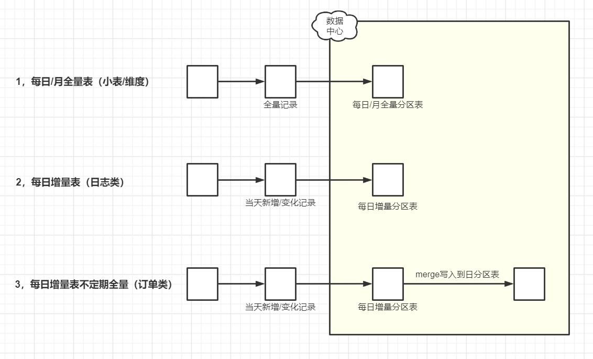

# 2020.11.03-数据入湖策略

## 0x01.离线入湖

### 1.每日/月全量表（小表/维表）

#### 抽取策略

如上图流程1，来源数据每日全量更新，采用数据库直连方式全量抽取，写入每日/每月全量分区表。实施步骤见数据入湖方案。

#### 存储策略

全量表，按天全量存储，生命周期根据业务需要可设置长周期（如366天或永久保存）

> 小数据量表指总数据量小于10万的表。

### 2.每日增量表（日志类）

#### 抽取策略

如上图流程2，原始日志增量抽取到每日增量表，按天增量存储。因为日志数据表只会新增不会有修改的情况，因此不需要保存全量表。实施步骤见数据入湖方案。
   
#### 存储策略

增量表，可设置长周期（如建议永久保存）；

### 3.每日增量表，不定期全量（订单类）

#### 抽取策略

如上图流程3，数据库直连方式通过业务时间戳抽取增量数据到今日增量分区表，再将今日增量分区表merge前一日全量分区表，写入今日全量分区表。实施步骤见数据入湖方案。

#### 存储策略

增量表，可设置长周期（如366天或永久保存）；
全量表，根据业务需求及存储资源考虑设置较长周期（如183天或366天或732天，若需要永久保存则要使用历史拉链处理）。

备注：大数据量表的数据量随业务的发展越来越大，在这种情况下，选择每次只同步新变更的增量数据，然后与上一同步周期获得的全量数据进行合并，从而获得最新版本的全量数据。具体使用的方式可用全外连接（full outer join） + 数据全量覆盖重新加载（insert overwrite）的方式。

## 0x02.实时入湖

### 1.实时追加（Hive、其他类似数据源）

对历史数据敏感的数据表，实时增量写入到MaxCompute增量表。业务对数据时效性较高，需要快速查询数据时，通过创建Hologres外表的方式对MaxCompute查询提速。
优点：

- 数据写入MaxCompute，计算及存储成本相对较低。
- 可以记录数据的历史变化状态流转。

缺点：

- 需要对数据进行merge合并，数据时效性不高，MaxCompute查询较满，对查询有性能要求需要通过Hologres进行外表加速。

### 2.实时更新（HBase、其他类似数据源）

对数据时效性要求较高的场景，实时增量数据写入Hologres。
优点：

- 数据时效性很高。

缺点：

- 历史数据量比较大的情况，使用Hologres全量存储成本较大。
- 不能保留数据的变化历史。
