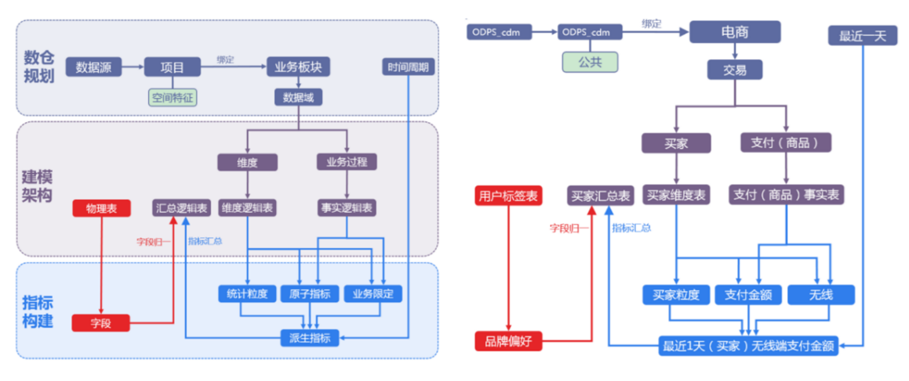
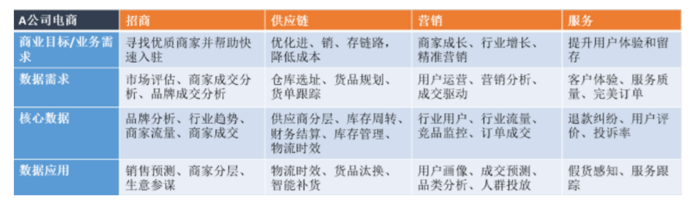
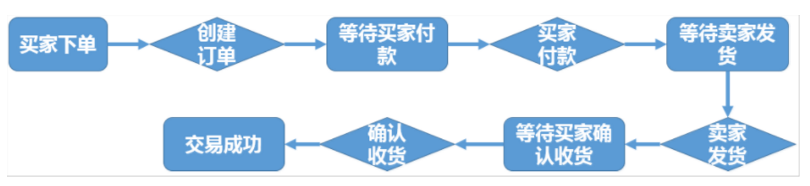
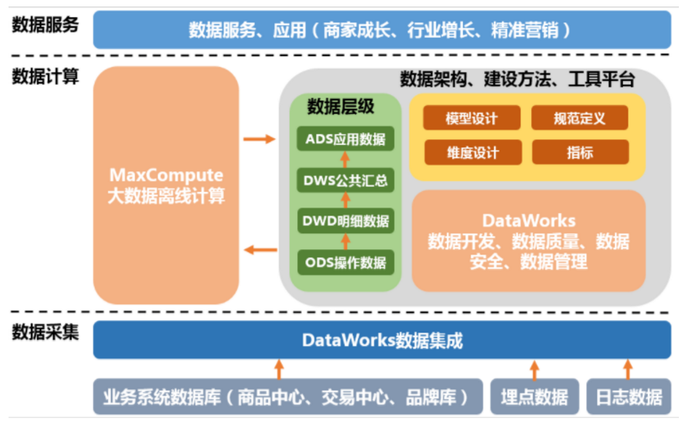
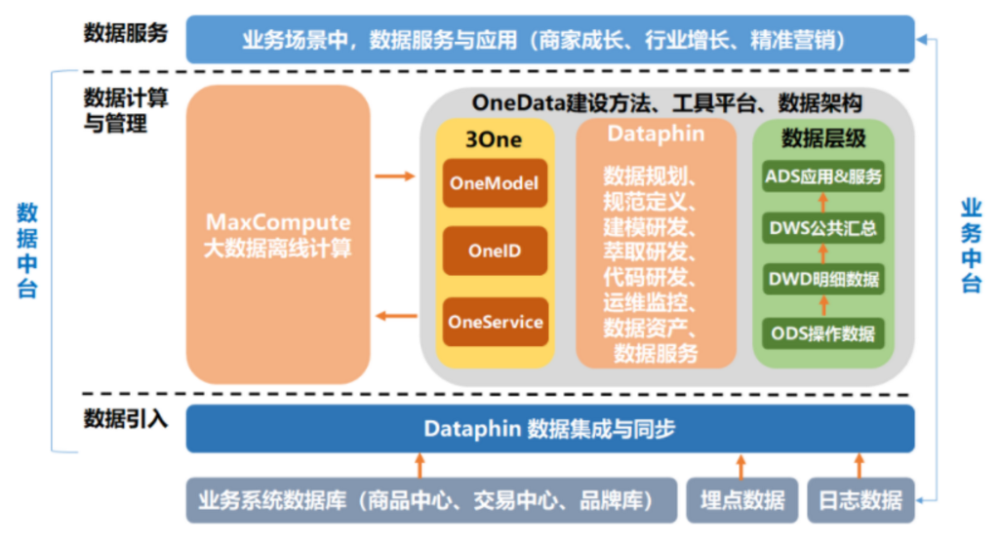
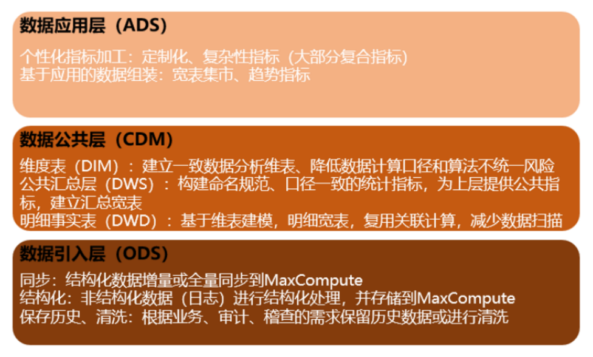
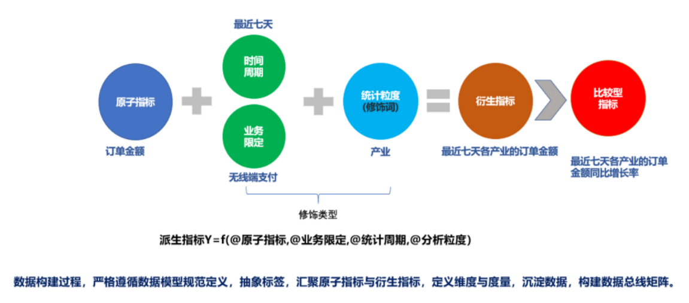

# 2020.12.25-阿里巴巴数据中台实施汇总

首先，这是一篇偏实施的文章，旨在整理介绍中台建设的一些术。

自从去年10月份国内某钢铁集团接触的数据中台整体规划项目开始，到整个20年一直在陆续做数据方面的工作，主要包括以下几个方面：
1. 数据接入
2. 数据仓库的分层建设
3. 数据建模及指标汇聚
4. 数据质量

一直跟随阿里的布道陆续记录了很多笔记，打算花些时间整理全部的内容形成资产沉淀，形成阿里数据中台体系的独特方法论。
本文主要讲从调研开始，到整体数据中台建设的一些必须方法论，前面已经写过的数据入湖及数据质量部分，不再多赘述。

[toc]

## 0x01.一切起始

已经2020年末了，不再这里介绍中台背景了，不是特别了解的同学推荐去查看几篇文章。推荐极客时间的几门中台课。

1. 《中台理论》
2. 《数据中台实战课》

## 0x02.基本概念

- **业务板块:** 业务板块定义了数据仓库的多种命名空间，是一种系统级的概念对象。当数据的业务含义存在较大差异时，您可以创建不同的业务板块，让各成员独立管理不同的业务，后续数据仓库的建设将按照业务板块进行划分。在Dataphin中，项目可以归属至业务板块以实现规范建模功能，同一个业务板块中可能包含多个不同的项目，所以业务板块与项目的关系为1：N。
- **数据域:** 数据域主要用于存放同一业务板块内不同概念的指标。例如，您可以划分出商品域、交易域、会员域等，用于存放不同意义的指标。
- **业务过程:** 业务过程即业务活动中所有的事件，通常为不可拆分的事件。创建业务过程，是为了从顶层视角，规范业务中的事务内容的类型及唯一性。
- **维度:** 维度即进行统计的对象。通常，维度是实际客观存在的实体。Dataphin遵循Ralph Kimball的维度建模理论，创建维度，即从顶层规范业务中实体（或称主数据）的存在性及唯一性。维度及维度组合，也是派生指标的统计粒度。
- **指标:** 指标分为原子指标和派生指标。派生指标是以原子指标为基准，组装统计粒度、统计周期及业务限定而生成的。
- **原子指标:** 对指标统计口径、具体算法的一个抽象。根据计算逻辑复杂性，Dataphin将原子指标分为两种：
- **原生的原子指标:** 例如支付金额。
- **衍生原子指标:** 基于原子指标组合构建。例如，客单价通过支付金额除以买家数组合而来。
- **派生指标:** 业务中常用的统计指标。为保证统计指标标准、规范、无二义性地生成，OneData方法论将派生指标抽象为四部分：派生指标=原子指标+业务限定+统计周期+统计粒度。
- **业务限定:** 统计的业务范围，用于筛选出符合业务规则的记录（类似于SQL中where后的条件，不包括时间区间）。原子指标是计算逻辑的标准化定义，业务限定则是条件限制的标准化定义。
- **统计周期:** 统计的时间范围，也可以称为时间周期。例如最近1天、最近30天等（类似于SQL中where后的时间条件）。
- **统计粒度:** 统计分析的对象或视角，定义数据需要汇总的程度，可以理解为聚合运算时的分组条件（类似于SQL中group by的对象）。粒度是维度的一个组合，指明您的统计范围。例如，某个指标是某个卖家在某个省份的成交额，则粒度就是卖家、省份这两个维度的组合。如果您需要统计全表的数据，则粒度为全表。在指定粒度时，您需要充分考虑到业务和维度的关系。统计粒度也被称为粒度，是维度或维度组合，一般用于派生指标构建，是汇总表的唯一性识别方式。

概念中的关系如下图：

## 0x03.确定需求

在进行数据仓库构建之前，首先需要确定数仓构建的目标与需求，进行全面的业务调研。您需要了解真实的业务需求是什么，以及确定整个业务系统能解决什么问题。

#### 1.业务调研

充分的业务调研和需求分析是数据仓库建设的基石，直接决定数据仓库能否建设成功。在数仓建设项目启动前，您需要请相关的业务人员介绍具体的业务，以便明确各个团队的分析员、运营人员的需求，沉淀出相关文档。

您可以通过调查表、访谈等形式详细了解以下信息：
- 用户的组织架构和分工界面。例如，用户可能分为数据分析、运营、维护部门，各个部门对数仓的需求不同，您需要对不同部门分别进行调研。
- 用户的整体业务架构，各个业务模块之间的联系与信息流动的流程。梳理出整体的业务数据框架。
- 各个已有的业务系统的主要功能及获取的数据。

本教程中以A公司的电商业务为例，梳理出业务数据框架如下图所示。A公司的电商业务板块分为招商、供应链、营销、服务四个板块，每个板块的需求和数据应用都不同。在您构建数仓之前，首先需要明确构建数仓服务的业务的板块和需要具体满足的业务需求。

此外，您还需要进一步了解各业务板块中已有的各数据功能模块。功能模块通常和业务板块紧耦合，对应一个或多个表，可以作为构建数仓的数据源。下表展现的是一个营销业务板块的数据功能模块。

功能模块|A公司电商营销管理
---|---
商品管理|Y
用户管理|Y
购买流程|Y
交易订单|Y
用户反馈|Y

> 说明 Y代表包含该功能模块，N代表不包含。

本教程中，假设用户是电商营销部门的营销数据分析师。数据需求为最近一天某个类目（例如：厨具）商品在各省的销售总额、该类目Top10销售额商品名称、各省客户购买力分布（人均消费额）等，用于营销分析。最终的业务需求是通过营销分析完成该类目的精准营销，提升销售总额。通过业务调研，我们将着力分析营销业务板块的交易订单功能模块。

#### 2.需求分析

在未考虑数据分析师、业务运营人员的数据需求的情况下，单纯根据业务调研建设的数据仓库，可能可用性较差。完成业务调研后，您需要进一步收集数据使用者的需求，进而对需求进行深度思考和分析，并改进数据仓库。

需求分析的途径有两种：
- 通过与分析师、业务运营人员的沟通获知需求。
- 对报表系统中现有的报表进行研究分析。

在需求分析阶段，您需要沉淀出业务分析或报表中的指标，以及指标的定义和粒度。粒度可以作为维度的输入。建议您思考下列问题，对后续的数据建模将有巨大的帮助：
- 业务数据是根据什么（维度、统计粒度，简称“粒度”，是维度或维度组合）汇总的，衡量标准是什么？例如，“省份”或者“类目”是维度，订单数是原子指标。
- 基于上个问题，进一步思考明细数据层的事实模型和公共可引用的维度模型、汇总数据层的汇总模型应该如何设计？是否有公共使用，命名及逻辑相似的统计指标，目前已经重复建设使用，需要通过上述设计规范化？

举例： 数据分析师需要了解A公司电商业务中最近1天厨具类目的成交金额。

当获知这个需求后，您需要分析：根据什么（维度）汇总、汇总什么（原子指标）、汇总的范围有多大（业务范围即业务限定，时间范围即统计周期）。例如，类目是统计粒度（基于维度），成交金额的总和是原子指标。该案例中，粒度应该是“类目”，“类目为厨具”是业务限定，最近1天是统计周期。

> **说明:** 本例从类目为统计粒度的角度，分析需求处理。您可以在即席查询中定义汇总模型的筛选过滤条件，设定统计粒度的维度属性值为厨具，以免汇总模型数据稀疏。在真实业务场景下，可以根据业务需求、使用频度、复用性及汇总层数据计算存储放慢进行考虑，拆解分析。例如，本例中还可以定义全表为粒度，只是该粒度中无需维度，然后定义业务限定是类目为厨具，其他保持不变，如无特殊数据情况，也可得到相同数据结果，只是计算存储过程消耗可能有不同。上述案例，不同路径，组合定义出来的派生指标，可能是相同结果，但是命名、计算逻辑实现可能略有不同。目前Dataphin上对于该类派生指标，认为是不同业务场景的指标，不进行强制去重。

基于上述拆解，您还需要进一步思考并设计明细数据层的事实模型（原子指标中成交金额的数据来源）、公共可引用的维度模型（统计粒度的来源，且需要与成交金额所属事实模型有关联关系）和汇总数据层模型（原子指标、业务限定、统计周期的拆解和定义方式）。

需求调研的分析产出通常是记录业务需求的规范定义文档（派生指标、原子指标、业务限定、统计周期、统计粒度（即维度））。结合业务调研情况，您可以进一步产出设计明细逻辑模型设计文档（维度模型、事实模型）与概念模型设计文档（维度、业务过程及其关系）。

## 0x04.分析业务过程

业务过程可以概括为一个个不可拆分的行为事件。用户的业务系统中，通过埋点或日常积累，通常已经获取了充足的业务数据。为理清数据之间的逻辑关系和流向，首先需要理解用户的业务过程，了解过程中涉及到的数据系统。

您可以采用过程分析法，将整个业务过程涉及的每个环节一一列清楚，包括技术、数据、系统环境等。在分析企业的工作职责范围（部门）后，您也可以借助工具通过逆向工程抽取业务系统的真实模型。您可以参考业务规划设计文档以及业务运行（开发、设计、变更等）相关文档，全面分析数据仓库涉及的源系统及业务管理系统：
- 每个业务会生成哪些数据，存在于什么数据库中。
- 对业务过程进行分解，了解过程中的每一个环节会产生哪些数据，数据的内容是什么。
- 数据在什么情况下会更新，更新的逻辑是什么。

业务过程可以是单个业务事件，例如交易的支付、退款等；也可以是某个事件的状态，例如当前的账户余额等；还可以是一系列相关业务事件组成的业务流程。具体取决于您分析的是某些事件过去发生情况、当前状态还是事件流转效率。

选择粒度：在业务过程事件分析中，您需要预判所有分析需要细分的程度和范围，从而决定选择的粒度。 识别维表、选择好粒度之后，您需要基于此粒度设计维表，包括维度属性等，用于分析时进行分组和筛选。最后，您需要确定衡量的指标。

本教程中，经过业务过程调研，我们了解到用户电商营销业务的交易订单功能模块的业务流程如下。

这是一个非常典型的电商交易业务流程图。在该业务流程图中，有创建订单、买家付款、卖家发货、确认收货四个核心业务步骤。由于确认收货代表交易成功，我们重点分析确认收货（交易成功）步骤即可。
在明确用户的业务过程之后，您可以根据需要进行分析决策的业务划分数据域。

## 0x05.划分数据域

数据仓库是面向主题（数据综合、归类并进行分析利用的抽象）的应用。数据仓库模型设计除横向的分层外，通常也需要根据业务情况进行纵向划分数据域。数据域是联系较为紧密的数据主题的集合，是业务对象高度概括的概念层次归类，目的是便于数据的管理和应用。

#### 1.划分数据域

通常，您需要阅读各源系统的设计文档、数据字典和数据模型设计文档，研究逆向导出的物理数据模型。进而，可以进行跨源的主题域合并，跨源梳理出整个企业的数据域。

数据域是指面向业务分析，将业务过程或者维度进行抽象的集合。为保障整个体系的生命力，数据域需要抽象提炼，并长期维护更新。在划分数据域时，既能涵盖当前所有的业务需求，又能让新业务在进入时可以被包含进已有的数据域或扩展新的数据域。数据域的划分工作可以在业务调研之后进行，需要分析各个业务模块中有哪些业务活动。

数据域可以按照用户企业的部门划分，也可以按照业务过程或者业务板块中的功能模块进行划分。例如A公司电商营销业务板块可以划分为如下数据域，数据域中每一部分都是实际业务过程经过归纳抽象之后得出的。

数据域|业务过程
---|---
会员店铺域|注册、登录、装修、开店、关店
商品域|发布、上架、下架、重发
日志域|曝光、浏览、点击
交易域|下单、支付、发货、确认收货
服务域|商品收藏、拜访、培训、优惠券领用
采购域|商品采购、供应链管理

### 0x06.定义维度与构建总线矩阵

明确每个数据域下有哪些业务过程后，您需要开始定义维度，并基于维度构建总线矩阵。

#### 1.定义维度

在划分数据域、构建总线矩阵时，需要结合对业务过程的分析定义维度。以本教程中A电商公司的营销业务板块为例，在交易数据域中，我们重点考察确认收货（交易成功）的业务过程。

在确认收货的业务过程中，主要有商品和收货地点（本教程中，假设收货和购买是同一个地点）两个维度所依赖的业务角度。从商品角度我们可以定义出以下维度：
- 商品ID（主键）
- 商品名称
- 商品交易价格
- 商品新旧程度： 1 全新 2 闲置 3 二手
- 商品类目ID
- 商品类目名称
- 品类ID
- 品类名称
- 买家ID
- 商品状态： 0 正常 1 删除 2 下架 3 从未上架
- 商品所在城市
- 商品所在省份

从地域角度，我们可以定义出以下维度：
- 城市code
- 城市名称
- 省份code
- 省份名称

作为维度建模的核心，在企业级数据仓库中必须保证维度的唯一性。以A公司的商品维度为例，有且只允许有一种维度定义。例如，省份code这个维度，对于任何业务过程所传达的信息都是一致的。

#### 2.构建总线矩阵

明确每个数据域下有哪些业务过程后，即可构建总线矩阵。您需要明确业务过程与哪些维度相关，并定义每个数据域下的业务过程和维度。如下所示是A公司电商板块交易功能的总线矩阵，我们定义了购买省份、购买城市、类目名称、类目ID、品牌名称、品牌ID、商品名称、商品ID、成交金额等维度。

## 0x06.明确统计指标

需求调研输出的文档中，含有原子指标与派生指标，此时我们需要在设计汇总层表模型前完成指标的设计。

### 1.指标定义注意事项

原子指标是明确的统计口径、计算逻辑： 原子指标=业务过程+度量。派生指标即常见的统计指标：派生指标=时间周期+修饰词+原子指标。原子指标的创建需要在业务过程定义后方才可创建。派生指标的创建一般需要在了解具体报表需求之后展开，在新建派生指标前必须新建好原子指标。 注意事项如下：

- 原子指标、修饰类型及修饰词，直接归属在业务过程下，其中修饰词继承修饰类型的数据域。
- 派生指标可以选择多个修饰词，由具体的派生指标语义决定。例如，支付金额为原子指标，则客单价（支付金额除以买家数）为派生指标。
- 派生指标唯一归属一个原子指标，继承原子指标的数据域，与修饰词的数据域无关。

### 2.根据业务需求确定指标

本教程中，用户是电商营销部门的营销数据分析师。数据需求为最近一天厨具类目的商品在各省的销售总额、该类目Top10销售额商品名称、各省用户购买力分布（人均消费额）等，用于营销分析。
根据之前的分析，我们确认业务过程为：确认收货（交易成功），而度量为商品的销售金额。因此根据业务需求，我们可以定义出原子指标：商品成功交易金额。

派生指标为：

- 最近一天全省厨具类目各商品销售总额
- 最近一天全省厨具类目人均消费额（消费总额除以人数）
- 最近一天全省厨具类目各商品销售总额进行降序排序后取前10名的名称，即可得到该类目Top10销售额商品名称。

## 0x07.技术架构选型

在数据模型设计之前，您需要首先完成技术架构的选型。本教程中使用阿里云大数据产品MaxCompute配合DataWorks，完成整体的数据建模和研发流程。

完整的技术架构图如下图所示。其中，DataWorks的数据集成负责完成数据的采集和基本的ETL。MaxCompute作为整个大数据开发过程中的离线计算引擎。DataWorks则囊括数据开发、数据质量、数据安全、数据管理等在内的一系列功能。

根据阿里巴巴OneData方法论最佳实践，在设计数据模型前，您需要完成技术架构的选型。本教程中使用阿里云大数据产品Dataphin配合MaxCompute，完成整体的数据建模和研发流程。
完整的技术架构如下图所示。其中，Dataphin的数据集成及同步负责完成源业务系统数据引入。MaxCompute作为整个大数据开发过程中的离线计算引擎。Dataphin则基于OneData方法论——OneModel、OneID、OneService，囊括了数据建模研发、运维中心、监控报警、数据资产等在内的一系列功能。

## 0x08.数仓分层

在阿里巴巴的数据体系中，我们建议将数据仓库分为三层，自下而上为：数据引入层（ODS，Operation Data Store）、数据公共层（CDM，Common Data Model）和数据应用层（ADS，Application Data Service）。

- 公共汇总层（DWS）：构建命名规范、口径一致的统计指标，为上层提供公共指标，建立汇总宽表
- 明细事实表（DWD）：基于维表建模，明细宽表，复用关联计算，减少数据扫描
- 维度表（DIM）：建立一直数据分析为表，降低数据计算口径和算法不统一风险

数据仓库的分层和各层级用途如下图所示。

在本教程中，从交易数据系统的数据经过DataWorks（开源组件Sqoop, Flume + Kafka等等）数据集成，同步到数据仓库的ODS层。经过数据开发形成事实宽表后，再以商品、地域等为维度进行公共汇总。
整体的数据流向如下图所示。其中，ODS层到DIM层的ETL（萃取（Extract）、转置（Transform）及加载（Load））处理是在MaxCompute(开源组件MR，Hive，Spark，Flink等)中进行的，处理完成后会同步到所有存储系统。ODS层和DWD层会放在数据中间件（HBase, HDFS, Hive表等）中，供下游订阅使用。而DWS层和ADS层的数据通常会落地到在线存储系统（MySql, MongoDB，ClickHourse一类偏实时）中，下游通过接口调用的形式使用。

- 数据引入层（ODS，Operational Data Store，又称数据基础层）：将原始数据几乎无处理地存放在数据仓库系统中，结构上与源系统基本保持一致，是数据仓库的数据准备区。这一层的主要职责是将基础数据同步、存储到MaxCompute。
- 数据公共层（CDM，Common Dimenions Model）：存放明细事实数据、维表数据及公共指标汇总数据。其中，明细事实数据、维表数据一般根据ODS层数据加工生成。公共指标汇总数据一般根据维表数据和明细事实数据加工生成。
- CDM层又细分为维度层（DIM）、明细数据层（DWD）和汇总数据层（DWS），采用维度模型方法作为理论基础， 可以定义维度模型主键与事实模型中外键关系，减少数据冗余，也提高明细数据表的易用性。在汇总数据层同样可以关联复用统计粒度中的维度，采取更多的宽表化手段构建公共指标数据层，提升公共指标的复用性，减少重复加工。
  - 维度层（DIM，Dimension）：以维度作为建模驱动，基于每个维度的业务含义，通过添加维度属性、关联维度等定义计算逻辑，完成属性定义的过程并建立一致的数据分析维表。为了避免在维度模型中冗余关联维度的属性，基于雪花模型构建维度表。 在Dataphin中，维度层的表通常也被称为维度逻辑表。
  - 明细数据层（DWD，Data Warehouse Detail）：以业务过程作为建模驱动，基于每个具体的业务过程特点，构建最细粒度的明细事实表。可以结合企业的数据使用特点，将明细事实表的某些重要属性字段做适当冗余，也即宽表化处理。 在Dataphin中，明细数据层的表通常也被称为事实逻辑表。
  - 汇总数据层（DWS，Data Warehouse Summary）：以分析的主题对象作为建模驱动，基于上层的应用和产品的指标需求，构建公共粒度的汇总指标表。以宽表化手段物理化模型，构建命名规范、口径一致的统计指标，为上层提供公共指标，建立汇总宽表、明细事实表。在Dataphin中，汇总数据层的表通常也被称为汇总逻辑表，用于存放派生指标数据。
- 数据应用层（ADS，Application Data Store）：存放数据产品个性化的统计指标数据，根据CDM层与ODS层加工生成。

### 1.数据引入层（ODS）

ODS层存放您从业务系统获取的最原始的数据，是其他上层数据的源数据。业务数据系统中的数据通常为非常细节的数据，经过长时间累积，且访问频率很高，是面向应用的数据。

> **说明:** 在构建MaxCompute数据仓库的表之前，您需要首先了解MaxCompute支持的数据类型。

#### (a).数据引入层表设计

本教程中，在ODS层主要包括的数据有：交易系统订单详情、用户信息详情、商品详情等。这些数据未经处理，是最原始的数据。逻辑上，这些数据都是以二维表的形式存储。虽然严格的说ODS层不属于数仓建模的范畴，但是合理的规划ODS层并做好数据同步也非常重要。本教程中，使用了6张ODS表：
- 记录用于拍卖的商品信息：s_auction。
- 记录用于正常售卖的商品信息：s_sale。
- 记录用户详细信息：s_users_extra。
- 记录新增的商品成交订单信息：s_biz_order_delta。
- 记录新增的物流订单信息：s_logistics_order_delta。
- 记录新增的支付订单信息：s_pay_order_delta。

> **说明:** 表或字段命名尽量和业务系统保持一致，但是需要通过额外的标识来区分增量和全量表。例如，我们通过_delta来标识该表为增量表。
命名时需要特别注意冲突处理，例如不同业务系统的表可能是同一个名称。为区分两个不同的表，您可以将这两个同名表的来源数据库名称作为后缀或前缀。例如，表中某些字段的名称刚好和关键字重名了，可以通过添加_col1后缀解决。

#### (b).ODS层设计规范

ODS层表命名、数据同步任务命名、数据产出及生命周期管理及数据质量规范请参见[ODS层设计规范](https://help.aliyun.com/document_detail/117434.html#concept-226666)。

#### (c).数据引入层存储

为了满足历史数据分析需求，您可以在ODS层表中添加时间维度作为分区字段。实际应用中，您可以选择采用增量、全量存储或拉链存储的方式。

- **增量存储** 

以天为单位的增量存储，以业务日期作为分区，每个分区存放日增量的业务数据。 举例如下：
1月1日，用户A访问了A公司电商店铺B，A公司电商日志产生一条记录t1。1月2日，用户A又访问了A公司电商店铺C，A公司电商日志产生一条记录t2。采用增量存储方式，t1将存储在1月1日这个分区中，t2将存储在1月2日这个分区中。
1月1日，用户A在A公司电商网购买了B商品，交易日志将生成一条记录t1。1月2日，用户A又将B商品退货了，交易日志将更新t1记录。采用增量存储方式，初始购买的t1记录将存储在1月1日这个分区中，更新后的t1将存储在1月2日这个分区中。

> **说明:** 交易、日志等事务性较强的ODS表适合增量存储方式。这类表数据量较大，采用全量存储的方式存储成本压力大。此外，这类表的下游应用对于历史全量数据访问的需求较小（此类需求可通过数据仓库后续汇总后得到）。例如，日志类ODS表没有数据更新的业务过程，因此所有增量分区UNION在一起就是一份全量数据。

- 全量存储

以天为单位的全量存储，以业务日期作为分区，每个分区存放截止到业务日期为止的全量业务数据。 例如， 1月1日，卖家A在A公司电商网发布了B、C两个商品，前端商品表将生成两条记录t1、t2。1月2日，卖家A将B商品下架了，同时又发布了商品D，前端商品表将更新记录t1，同时新生成记录t3。采用全量存储方式， 在1月1日这个分区中存储t1和t2两条记录，在1月2日这个分区中存储更新后的t1以及t2、t3记录。

> **说明:** 对于小数据量的缓慢变化维度数据，例如商品类目，可直接使用全量存储。

- 拉链存储

拉链存储通过新增两个时间戳字段（start_dt和end_dt），将所有以天为粒度的变更数据都记录下来，通常分区字段也是这两个时间戳字段。
拉链存储举例如下：

商品 | start_dt | end_dt | 卖家 | 状态
---|---|---|---|---
B | 20160101 | 20160102 | A | 上架
C | 20160101 | 30001231 | A | 上架
B | 20160102 | 30001231 | A | 下架

这样，下游应用可以通过限制时间戳字段来获取历史数据。例如，用户访问1月1日数据，只需限制 stat_dt<=20160101 and end_dt>20160101。

#### (d).缓慢变化维度

MaxCompute不推荐使用代理键，推荐使用自然键作为维度主键，主要原因有两点：**什么是代理键？即为业务无关为数据库技术而产生的字段，比如流水号的主键。**
- MaxCompute是分布式计算引擎，生成全局唯一的代理键工作量非常大。当遇到大数据量情况下，这项工作就会更加复杂，且没有必要。
- 使用代理键会增加ETL的复杂性，从而增加ETL任务的开发和维护成本。
- 因为是分布式系统，统一不重复的代理键维护起来并不容易。
在不使用代理键的情况下，缓慢变化维度可以通过快照方式处理。
快照方式下数据的计算周期通常为每天一次。基于该周期，处理维度变化的方式为每天一份全量快照。

例如商品维度，每天保留一份全量商品快照数据。任意一天的事实表均可以取到当天的商品信息，也可以取到最新的商品信息，通过限定日期，采用自然键进行关联即可。该方式的优势主要有以下两点：
- 处理缓慢变化维度的方式简单有效，开发和维护成本低。
- 使用方便，易于理解。数据使用方只需要限定日期即可取到当天的快照数据。任意一天的事实快照与任意一天的维度快照通过维度的自然键进行关联即可。

该方法的弊端主要是存储空间的极大浪费。例如某维度每天的变化量占总体数据量比例很低，极端情况下，每天无变化，这种情况下存储浪费严重。该方法主要实现了通过牺牲存储获取ETL效率的优化和逻辑上的简化。请避免过度使用该方法，且必须要有对应的数据生命周期制度，清除无用的历史数据。

@link: 这里不扩展篇幅讲解**代理键和自然键**，麻烦感兴趣的小伙伴自行google。

#### (e).数据同步加载与处理

ODS的数据需要由各数据源系统同步到MaxCompute（也可以是开源的hadoop生态的计算引擎），才能用于进一步的数据开发。本教程建议您使用DataWorks数据集成功能完成数据同步，详情请参见数据集成概述。在使用数据集成的过程中，建议您遵循以下规范：
- 一个系统的源表只允许同步到MaxCompute一次，保持表结构的一致性。
- 数据集成仅用于离线全量数据同步，实时增量数据同步需要您使用数据传输服务DTS实现，详情请参见数据传输服务DTS。
- 数据集成全量同步的数据直接进入全量表的当日分区。
- ODS层的表建议以统计日期及时间分区表的方式存储，便于管理数据的存储成本和策略控制。
- 数据集成可以自适应处理源系统字段的变更：
- 如果源系统字段的目标表在MaxCompute上不存在，可以由数据集成自动添加不存在的表字段。
- 如果目标表的字段在源系统不存在，数据集成填充NULL。

### 2.公共维度汇总层（DIM）

公共维度层（DIM）基于维度建模理念，建立整个企业的一致性维度。
公共维度层主要由维度表（维表）构成。维度是逻辑概念，是衡量和观察业务的角度。维表是根据维度及其属性将数据平台上构建的表物理化的表，采用宽表设计的原则。因此，构建公共维度层（DIM）首先需要定义维度。

#### (a).定义维度

在划分数据域、构建总线矩阵时，需要结合对业务过程的分析定义维度。以本教程中A电商公司的营销业务板块为例，在交易数据域中，我们重点考察确认收货（交易成功）的业务过程。

在确认收货的业务过程中，主要有商品和收货地点（本教程中，假设收货和购买是同一个地点）两个维度所依赖的业务角度。从商品角度可以定义出以下维度：

- 商品ID
- 商品名称
- 商品价格
- 商品新旧程度： 0 全新 1 闲置 2 二手
- 商品类目ID
- 商品类目名称
- 品类ID
- 品类名称
- 买家ID
- 商品状态： 0 正常 1 用户删除 2 下架 3 从未上架
- 商品所在城市
- 商品所在省份

从地域角度，可以定义出以下维度：

- 买家ID
- 城市code
- 城市名称
- 省份code
- 省份名称

作为维度建模的核心，在企业级数据仓库中必须保证维度的唯一性。以A公司的商品维度为例，有且只允许有一种维度定义。例如，省份code这个维度，对于任何业务过程所传达的信息都是一致的。

#### (b).设计维表

完成维度定义后，您就可以对维度进行补充，进而生成维表了。维表的设计需要注意：
- 建议维表单表信息不超过1000万条。
- 维表与其他表进行Join时，建议您使用Map Join。使用mapjoin缓存小表，可以有效避免数据倾斜。
- 避免过于频繁的更新维表的数据。

在设计维表时，您需要从下列方面进行考虑：
- 维表中数据的稳定性。例如A公司电商会员通常不会出现消亡，但会员数据可能在任何时候更新，此时要考虑创建单个分区存储全量数据。如果存在不会更新的记录，您可能需要分别创建历史表与日常表。日常表用于存放当前有效的记录，保持表的数据量不会膨胀；历史表根据消亡时间插入对应分区，使用单个分区存放分区对应时间的消亡记录。
- 是否需要垂直拆分。如果一个维表存在大量属性不被使用，或由于承载过多属性字段导致查询变慢，则需考虑对字段进行拆分，创建多个维表。
- 是否需要水平拆分。如果记录之间有明显的界限，可以考虑拆成多个表或设计成多级分区。
- 核心的维表产出时间通常有严格的要求。

设计维表的主要步骤如下：
1. 完成维度的初步定义，并保证维度的一致性。
2. 确定主维表（中心事实表，本教程中采用星型模型）。此处的主维表通常是数据引入层（ODS）表，直接与业务系统同步。例如，s_auction是与前台商品中心系统同步的商品表，此表即是主维表。
3. 确定相关维表。数据仓库是业务源系统的数据整合，不同业务系统或者同一业务系统中的表之间存在关联性。根据对业务的梳理，确定哪些表和主维表存在关联关系，并选择其中的某些表用于生成维度属性。以商品维度为例，根据对业务逻辑的梳理，可以得到商品与类目、卖家、店铺等维度存在关联关系。
4. 确定维度属性，主要包括两个阶段。第一个阶段是从主维表中选择维度属性或生成新的维度属性；第二个阶段是从相关维表中选择维度属性或生成新的维度属性。以商品维度为例，从主维表（ s_auction）和类目 、卖家、店铺等相关维表中选择维度属性或生成新的维度属性。
5. 尽可能生成丰富的维度属性。
6. 尽可能多地给出富有意义的文字性描述。
7. 区分数值型属性和事实。
8. 尽量沉淀出通用的维度属性。

#### (c).公共维度汇总层（DIM）维表规范

公共维度汇总层（DIM）维表命名规范：dim_{业务板块名称/pub}_{维度定义}[_{自定义命名标签}]，所谓pub是与具体业务板块无关或各个业务板块都可公用的维度，如时间维度。举例如下：
- 公共区域维表 dim_pub_area
- A公司电商板块的商品全量表dim_asale_itm

### 3.明细粒度事实层（DWD）

明细粒度事实层以业务过程驱动建模，基于每个具体的业务过程特点，构建最细粒度的明细层事实表。您可以结合企业的数据使用特点，将明细事实表的某些重要维度属性字段做适当冗余，即宽表化处理。
公共汇总粒度事实层（DWS）和明细粒度事实层（DWD）的事实表作为数据仓库维度建模的核心，需紧绕业务过程来设计。通过获取描述业务过程的度量来描述业务过程，包括引用的维度和与业务过程有关的度量。度量通常为数值型数据，作为事实逻辑表的依据。事实逻辑表的描述信息是事实属性，事实属性中的外键字段通过对应维度进行关联。
事实表中一条记录所表达的业务细节程度被称为粒度。通常粒度可以通过两种方式来表述：一种是维度属性组合所表示的细节程度，一种是所表示的具体业务含义。

作为度量业务过程的事实，通常为整型或浮点型的十进制数值，有可加性、半可加性和不可加性三种类型：
- 可加性事实是指可以按照与事实表关联的任意维度进行汇总。
- 半可加性事实只能按照特定维度汇总，不能对所有维度汇总。例如库存可以按照地点和商品进行汇总，而按时间维度把一年中每个月的库存累加则毫无意义。
- 完全不可加性，例如比率型事实。对于不可加性的事实，可分解为可加的组件来实现聚集。

事实表相对维表通常更加细长，行增加速度也更快。维度属性可以存储到事实表中，这种存储到事实表中的维度列称为维度退化，可加快查询速度。与其他存储在维表中的维度一样，维度退化可以用来进行事实表的过滤查询、实现聚合操作等。

明细粒度事实层（DWD）通常分为三种：事务事实表、周期快照事实表和累积快照事实表。

- 事务事实表用来描述业务过程，跟踪空间或时间上某点的度量事件，保存的是最原子的数据，也称为原子事实表。
- 周期快照事实表以具有规律性的、可预见的时间间隔记录事实。
- 累积快照事实表用来表述过程开始和结束之间的关键步骤事件，覆盖过程的整个生命周期，通常具有多个日期字段来记录关键时间点。当累积快照事实表随着生命周期不断变化时，记录也会随着过程的变化而被修改。

#### (a).明细粒度事实表设计原则

明细粒度事实表设计原则如下所示：

- 通常，一个明细粒度事实表仅和一个维度关联。
- 尽可能包含所有与业务过程相关的事实 。
- 只选择与业务过程相关的事实。
- 分解不可加性事实为可加的组件。
- 在选择维度和事实之前必须先声明粒度。
- 在同一个事实表中不能有多种不同粒度的事实。
- 事实的单位要保持一致。
- 谨慎处理Null值。
- 使用退化维度提高事实表的易用性。

明细粒度事实表整体设计流程如下图所示。

在一致性度量中已定义好了交易业务过程及其度量。明细事实表注意针对业务过程进行模型设计。明细事实表的设计可以分为四个步骤：选择业务过程、确定粒度、选择维度、确定事实（度量）。粒度主要是在维度未展开的情况下记录业务活动的语义描述。在您建设明细事实表时，需要选择基于现有的表进行明细层数据的开发，清楚所建表记录存储的是什么粒度的数据。

#### (b).明细粒度事实层（DWD）规范

通常您需要遵照的命名规范为：dwd_{业务板块/pub}_{数据域缩写}_{业务过程缩写}[_{自定义表命名标签缩写}] _{单分区增量全量标识}，pub表示数据包括多个业务板块的数据。单分区增量全量标识通常为：i表示增量，f表示全量。例如： dwd_asale_trd_ordcrt_trip_di（A电商公司航旅机票订单下单事实表，日刷新增量）及dwd_asale_itm_item_df（A电商商品快照事实表，日刷新全量）。

本教程中，DWD层主要由三个表构成：
- 交易商品信息事实表：dwd_asale_trd_itm_di。
- 交易会员信息事实表：ods_asale_trd_mbr_di。
- 交易订单信息事实表：dwd_asale_trd_ord_di。

### 4.公共汇总粒度事实层（DWS）

公共汇总粒度事实层以分析的主题对象作为建模驱动，基于上层的应用和产品的指标需求构建公共粒度的汇总指标事实表。公共汇总层的一个表通常会对应一个派生指标。

#### (a).公共汇总事实表设计原则

聚集是指针对原始明细粒度的数据进行汇总。DWS公共汇总层是面向分析对象的主题聚集建模。在本教程中，最终的分析目标为：最近一天某个类目（例如：厨具）商品在各省的销售总额、该类目Top10销售额商品名称、各省用户购买力分布。因此，我们可以以最终交易成功的商品、类目、买家等角度对最近一天的数据进行汇总。

> **注意:** 
聚集是不跨越事实的。聚集是针对原始星形模型进行的汇总。为获取和查询与原始模型一致的结果，聚集的维度和度量必须与原始模型保持一致，因此聚集是不跨越事实的。
聚集会带来查询性能的提升，但聚集也会增加ETL维护的难度。当子类目对应的一级类目发生变更时，先前存在的、已经被汇总到聚集表中的数据需要被重新调整。

此外，进行DWS层设计时还需遵循以下原则：

- 数据公用性：需考虑汇总的聚集是否可以提供给第三方使用。您可以判断，基于某个维度的聚集是否经常用于数据分析中。如果答案是肯定的，就有必要把明细数据经过汇总沉淀到聚集表中。
- 不跨数据域。数据域是在较高层次上对数据进行分类聚集的抽象。数据域通常以业务过程进行分类，例如交易统一划到交易域下， 商品的新增、修改放到商品域下。
- 区分统计周期。在表的命名上要能说明数据的统计周期，例如_1d表示最近1天，td表示截至当天，nd表示最近N天。

#### (b).公共汇总事实表规范

公共汇总事实表命名规范：dws_{业务板块缩写/pub}_{数据域缩写}_{数据粒度缩写}[_{自定义表命名标签缩写}]_{统计时间周期范围缩写}。
关于统计实际周期范围缩写，缺省情况下，离线计算应该包括最近一天（_1d），最近N天（_nd）和历史截至当天（_td）三个表。如果出现_nd的表字段过多需要拆分时，只允许以一个统计周期单元作为原子拆分。即一个统计周期拆分一个表，例如最近7天（_1w）拆分一个表。不允许拆分出来的一个表存储多个统计周期。

- 对于小时表（无论是天刷新还是小时刷新），都用_hh 来表示。
- 对于分钟表（无论是天刷新还是小时刷新），都用_mm来表示。

举例如下：
- dws_asale_trd_byr_subpay_1d（A电商公司买家粒度交易分阶段付款一日汇总事实表）
- dws_asale_trd_byr_subpay_td（A电商公司买家粒度分阶段付款截至当日汇总表）
- dws_asale_trd_byr_cod_nd（A电商公司买家粒度货到付款交易汇总事实表）
- dws_asale_itm_slr_td（A电商公司卖家粒度商品截至当日存量汇总表）
- dws_asale_itm_slr_hh（A电商公司卖家粒度商品小时汇总表）---维度为小时
- dws_asale_itm_slr_mm（A电商公司卖家粒度商品分钟汇总表）---维度为分钟

## 0x09.开发规范

### 1.层次调用规范

ADS应用层优先调用数据仓库公共层数据。如果已经存在CDM层数据，不允许ADS应用层跨过CDM中间层从ODS层重复加工数据。CDM中间层应该积极了解应用层数据的建设需求，将公用的数据沉淀到公共层，为其他数据层次提供数据服务。同时，ADS应用层也需积极配合CDM中间层进行持续的数据公共建设的改造。避免出现过度的ODS层引用、不合理的数据复制和子集合冗余。总体遵循的层次调用原则如下：

- ODS层数据不能直接被应用层任务引用。如果中间层没有沉淀的ODS层数据，则通过CDM层的视图访问。CDM层视图必须使用调度程序进行封装，保持视图的可维护性与可管理性。
- CDM层任务的深度不宜过大（建议不超过10层）。
- 一个计算刷新任务只允许一个输出表，特殊情况除外。
- CDM汇总层优先调用CDM明细层，可累加指标计算。CDM汇总层尽量优先调用已经产出的粗粒度汇总层，避免大量汇总层数据直接从海量的明细数据层中计算得出。
- CDM明细层累计快照事实表优先调用CDM事务型事实表，保持数据的一致性产出。
- 有针对性地建设CDM公共汇总层，避免应用层过度引用和依赖CDM层明细数据。

### 2.表的其他优化技巧

- 中间表的利用：适用于数据量非常大，下游任务很多的表。
- 拆表：适用于个别字段产出极慢的情况，您可以将字段拆分为单独的表。
- 合表：随着数仓的发展，针对业务重叠或重复的表，您可以进行任务和数据合并。
- 拉链表：合理利用拉链表能减少您的存储消耗。

### 3.数据分类架构

该数据分类架构在ODS层分为三部分：数据准备区、离线数据和准实时数据区。在进入到CDM层后，由以下几部分组成：
公共维度层：基于维度建模理念思想，建立整个企业的一致性维度。在这里会确认one id，很重要，关系到后续数据域建设线管。
明细粒度事实层：以业务过程为建模驱动，基于每个具体业务过程的特点，构建最细粒度的明细层事实表。您可以结合企业的数据使用特点，将明细事实表的某些重要维度属性字段做适当的冗余，即宽表化处理（维度退化）。进行维度退化是为了数据的响应速度等。
公共汇总粒度事实层：以分析的主题对象为建模驱动，基于上层的应用和产品的指标需求，构建公共粒度的汇总指标事实表，以宽表化手段来物理化模型。
传统的ads层在这里不体现，ads更像是一个逻辑概念，里面可能包括了宽表层的一些数据指标，同样为了更喜欢一般将统计后的结果不能可复用的，直接对接应用的数据放置在应用数据层，也就是ads

### 4.数据划分及命名空间约定

请根据业务划分数据并约定命名，建议针对业务名称结合数据层次约定相关命名的英文缩写，这样可以给后续数据开发过程中，对项目空间、表、字段等命名做为重要参照。

- 按业务划分：命名时按主要的业务划分，以指导物理模型的划分原则、命名原则及使用的ODS project。例如，按业务定义英文缩写，阿里的“淘宝”英文缩写可以定义为“tb”。
- 按数据域划分：命名时按照CDM层的数据进行数据域划分，以便有效地对数据进行管理，以及指导数据表的命名。例如，“交易”数据的英文缩写可定义为“trd”。
- 按业务过程划分：当一个数据域由多个业务过程组成时，命名时可以按业务流程划分。业务过程是从数据分析角度看客观存在的或者抽象的业务行为动作。例如，交易数据域中的“退款”这个业务过程的英文缩写可约定命名为“rfd_ent”。

### 5.数据规范定义设计

规范定义是指以维度建模、3NF范式建模作为理论基础，构建总线矩阵，划分和定义数据域、业务过程、维度、度量、原子指标、修饰类型、修饰词、时间周期、衍生指标等。细粒度的划分便于指标的规则沉淀。
衍生指标构成：原子指标、业务限定、时间周期、统计粒度。其中原子子标必须有，时间周期、业务限定、统计粒度等可选。

解释一下：这里算子指标就是我们已经存在的事实表，在这基础上我们会有一定的维度限定条件举个例子。订单表可以使用时间周期限定（最近一个月）也可以使用特定的业务限定（移动端支付/pc支付）等当然有的指标也是同样可以用于统计维度的，但是我们对目前这个指标用sql理解就是where后面的条件，而统计维度则是基于这个维度进行分组聚合例如统计某一个地区（北京或上海的用户）或某一周产业（电子产品或者母婴等）使用sql方式去理解这里其实就是group by后面的字段，通过前面的限界条件可以得到一个新的衍生指标，这就是我们结果数据。一般这类衍生的指标是直接服务于数据应用或者发布成数据服务，存储在ads层
基于上述的数据定义，结合数据及业务的可持续发展，建议进行的表命名规范，所有的规范初期都是比较繁琐复杂，但坚持下来可以带来的复利是可以见到的：
- ODS：ods_[业务库名]_{业务库原始表名}[_delta]，delta标记该表是不是一个增量表？
- DWD：dwd_{主题缩写}_{业务过程缩写}[_自定义标签缩写]_{单分区增量全量标识}
- DWS：dws_{数据域缩写}[_自定义标签缩写]_{刷新周期标识}
- ADS：ads_ [_业务应用缩写][_维度][_自定义标签缩写]_{刷新周期标识}
- DIM：dim_{维度定义}

### 6.数据模型

模型是对现实事物的反映和抽象，能帮助我们更好地了解客观世界。数据模型定义了数据之间关系和结构，使得我们可以有规律地获取想要的数据。例如，在一个超市里，商品的布局都有特定的规范，商品摆放的位置是按照消费者的购买习惯以及人流走向进行摆放的。
数据模型的作用
数据模型是在业务需求分析之后，数据仓库工作开始时的第一步。良好的数据模型可以帮助我们更好地存储数据，更有效率地获取数据，保证数据间的一致性。

**模型设计的基本原则：**
高内聚和低耦合：一个逻辑和物理模型由哪些记录和字段组成，应该遵循最基本的软件设计方法论中的高内聚和低耦合原则。主要从数据业务特性和访问特性两个角度来考虑：将业务相近或者相关的数据、粒度相同数据设计为一个逻辑或者物理模型；将高概率同时访问的数据放一起，将低概率同时访问的数据分开存储。
核心模型与扩展模型分离：建立核心模型与扩展模型体系，核心模型包括的字段支持常用核心的业务，扩展模型包括的字段支持个性化或是少量应用的需要。在必须让核心模型与扩展模型做关联时，不能让扩展字段过度侵入核心模型，以免破坏了核心模型的架构简洁性与可维护性。
公共处理逻辑下沉及单一：底层公用的处理逻辑应该在数据调度依赖的底层进行封装与实现，不要让公用的处理逻辑暴露给应用层实现，不要让公共逻辑在多处同时存在。
成本与性能平衡：适当的数据冗余可换取查询和刷新性能，不宜过度冗余与数据复制。
数据可回滚：处理逻辑不变，在不同时间多次运行数据的结果需确定不变。
一致性：相同的字段在不同表中的字段名必须相同。
命名清晰可理解：表命名规范需清晰、一致，表命名需易于下游的理解和使用。

一个模型无法满足所有的需求。
需合理选择数据模型的建模方式。
通常，设计顺序依次为：概念模型->逻辑模型->物理模型。
